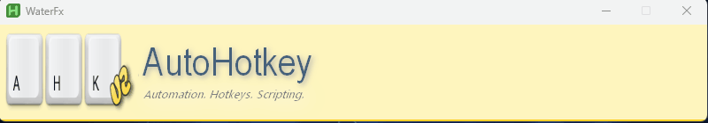

# Win32 Bitmap Water Effect DLL

<p align="center">

</p>

> [!IMPORTANT]
> A 32bpp device-independent bitmap (DIB) is required.

## Examples

<details>
<summary><h4>AutoHotkey</h4></summary>

<https://www.autohotkey.com>

```autohotkey
#Requires AutoHotkey v2.0.12 32-Bit
#DllLoad waterfx.dll

logo := LoadPicture(FileSelect(3, A_ScriptDir . '\logo.bmp'))

wfx1 := WaterFx(logo)
wfx2 := WaterFx(logo)

ui := Gui(, 'WaterFx')
ui.OnEvent('Escape', (*) => ExitApp())
ui.OnEvent('Close', (*) => ExitApp())
ui.Show(Format('w{} h{}', wfx1.Width, wfx1.Height + 10 + wfx2.Height))

wfx1.Start(ui.Hwnd, 0, 0)
wfx1.SetBlob(2, 30, 3, 300, 4, 500)

wfx2.Start(ui.Hwnd, 0, wfx1.Height + 10)
wfx2.SetBlob(2, 30, 3, 300, 4, 500)

class WaterFx {
    __New(bitmap) {
        this.id := DllCall('waterfx\create', 'Ptr', bitmap, 'Ptr')
    }

    __Delete() {
        DllCall('waterfx\destroy', 'Ptr', this.id)
    }

    SetDensity(density := 4) {
        DllCall('waterfx\set_density', 'Ptr', this.id, 'Int', density)
    }

    SetRenderingDelay(delay := 25) {
        DllCall('waterfx\set_delay', 'Ptr', this.id, 'Int', delay)
    }

    Clear() {
        DllCall('waterfx\clear', 'Ptr', this.id)
    }

    Render(hWnd, x := 0, y := 0) {
        DllCall('waterfx\render', 'Ptr', this.id, 'Ptr', hWnd, 'Int', x, 'Int', y)
    }

    Blob(x, y, radius := 2, height := 30) {
        DllCall('waterfx\blob', 'Ptr', this.id, 'Int', x, 'Int', y, 'Int', radius, 'Int', height)
    }

    SetBlob(radius, height, r2, h2, r3, h3) {
        DllCall('waterfx\wm_mousemove', 'Ptr', this.id, 'Int', radius, 'Int', height)
        DllCall('waterfx\wm_lbuttondown', 'Ptr', this.id, 'Int', r2, 'Int', h2)
        DllCall('waterfx\wm_lbuttonup', 'Ptr', this.id, 'Int', r3, 'Int', h3)
    }

    Start(hWnd, x := 0, y := 0, w := 0, h := 0) {
        DllCall('waterfx\set_hwnd', 'Ptr', this.id, 'Ptr', hWnd)
        DllCall('waterfx\set_pos', 'Ptr', this.id, 'Int', x, 'Int', y)
        DllCall('waterfx\resize', 'Ptr', this.id, 'Int', w, 'Int', h)
        DllCall('waterfx\start', 'Ptr', this.id)
    }

    Stop() {
        DllCall('waterfx\stop', 'Ptr', this.id)
    }

    Width => DllCall('waterfx\width', 'Ptr', this.id)
    Height => DllCall('waterfx\height', 'Ptr', this.id)
}
```

</details>

<details>
<summary><h4>Inno Setup</h4></summary>

Function definitions:

```pascal
function create(bmp: HBITMAP): THandle;
external 'create@files:waterfx.dll stdcall delayload';
procedure destroy(id: THandle);
external 'destroy@files:waterfx.dll stdcall delayload';
procedure set_hwnd(id: THandle; wnd: HWND);
external 'set_hwnd@files:waterfx.dll stdcall delayload';
procedure set_pos(id: THandle; x,y: Integer);
external 'set_pos@files:waterfx.dll stdcall delayload';
procedure set_alpha_format(id: THandle; afmt: Integer);
external 'set_alpha_format@files:waterfx.dll stdcall delayload';
procedure resize(id: THandle; width,height: Integer);
external 'resize@files:waterfx.dll stdcall delayload';
procedure autosize(id: THandle; enabled: Boolean);
external 'autosize@files:waterfx.dll stdcall delayload';
procedure blob(id: THandle; x,y,radius,height: Integer);
external 'blob@files:waterfx.dll stdcall delayload';
procedure start(id: THandle);
external 'start@files:waterfx.dll stdcall delayload';
procedure stop(id: THandle);
external 'stop@files:waterfx.dll stdcall delayload';
procedure set_density(id: THandle; density: Integer);
external 'set_density@files:waterfx.dll stdcall delayload';
procedure wm_mousemove(id: THandle; radius,height: Integer);
external 'wm_mousemove@files:waterfx.dll stdcall delayload';
procedure wm_lbuttondown(id: THandle; radius,height: Integer);
external 'wm_lbuttondown@files:waterfx.dll stdcall delayload';
procedure wm_lbuttonup(id: THandle; radius,height: Integer);
external 'wm_lbuttonup@files:waterfx.dll stdcall delayload';
```

<details>
<summary>Non Resizable</summary>

```pascal
[Setup]
AppName=My App
AppVersion=1
WizardResizable=no
WizardSizePercent=100
WizardStyle=modern
OutputDir=.
DefaultDirName=\My App
DisableWelcomePage=no

[Files]
Source: "waterfx.dll"; Flags: dontcopy
;Source: "logo.bmp"; Flags: dontcopy

[Code]
// <FUNCTION DEFINITIONS>

var
  wfx: THandle;
  logo: TBitmapImage;

const
  TOP = 50;
  LEFT = 50;

procedure InitializeWizard();
begin
  logo := TBitmapImage.Create(WizardForm);
  logo.Bitmap.LoadFromFile(ExpandConstant('{src}\logo.bmp'));

  WizardForm.OuterNotebook.Hide;
  WizardForm.ClientWidth := logo.Bitmap.Width + 2 * LEFT;

  wfx := create(logo.Bitmap.Handle);
  //set_alpha_format(wfx, $01);
  set_hwnd(wfx, WizardForm.Handle);
  set_pos(wfx, LEFT, TOP);
  start(wfx);

  // Blob on mouse events.
  // Set to 0 to disable.
  wm_mousemove(wfx, 2, 30);
  wm_lbuttondown(wfx, 3, 300);
  wm_lbuttonup(wfx, 4, 500);
end;

procedure DeinitializeSetup();
begin
  destroy(wfx);
  WizardForm.Free;
end;
```

</details>

<details>
<summary>Resizable</summary>

```pascal
[Setup]
AppName=My App
AppVersion=1
WizardResizable=yes
WizardSizePercent=100
WizardStyle=modern
OutputDir=.
DefaultDirName=\My App
DisableWelcomePage=no

[Files]
Source: "waterfx.dll"; Flags: dontcopy
;Source: "logo.bmp"; Flags: dontcopy

[Code]
// <FUNCTION DEFINITIONS>

var
  wfx: THandle;
  logo: TBitmapImage;

const
  TOP = 50;
  LEFT = 50;

procedure InitializeWizard();
begin
  logo := TBitmapImage.Create(WizardForm);
  logo.Bitmap.LoadFromFile(ExpandConstant('{src}\logo.bmp'));

  WizardForm.OuterNotebook.Hide;
  WizardForm.ClientWidth := logo.Bitmap.Width + 2 * LEFT;

  wfx := create(logo.Bitmap.Handle);
  resize(wfx, WizardForm.ClientWidth - 2 * LEFT, 0);
  set_hwnd(wfx, WizardForm.Handle);
  set_pos(wfx, LEFT, TOP);
  autosize(wfx, True);
  start(wfx);

  wm_mousemove(wfx, 2, 30);
  wm_lbuttondown(wfx, 3, 300);
end;

procedure DeinitializeSetup();
begin
  destroy(wfx);
  WizardForm.Free;
end;
```

</details>

</details>
